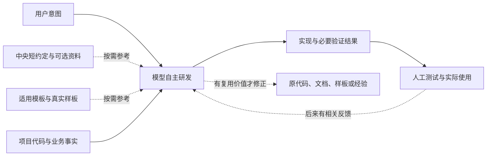

# 当前系统评分、使用环节与演进建议

评估日期：2026-09-07。评估对象：中央 V3.0.0 当前工作树（HEAD `5f6661f` 加本轮讨论产生的未提交修改）、三个登记模板的当前可见入口和样板。

本文保留评估时的事实与建议，**报告本身不授权或自动执行调整**。评估时仅新增此文档。用户随后明确授权处理局部流程表述和 App 入口，A1 及 A5 中的 App 入口部分已落实，详情见[执行方案第七节](77-模型自主研发执行方案.md)；服务端整理和其他建议未因此自动实施。下文评分与流程现状是修改前的评估快照，不因规则改动自动提高评分。目标仍以[架构与原则](10-架构与原则.md)为准。

## 一、结论与评分

**方向判断：9/10；围绕目标的建设成熟度：约 7/10；真实一次解决率和净收益：目前无法可靠评分。**

系统已经建立较好的轻量研发基础：模型自主选择动作，中央有简短入口和可选工具，Web/App 有具体工程结构与代码参照。主要不足集中在业务项目接入、整体效果参照、资料口径一致性，以及改进是否真实减少了返工的证据。

最高目标是“所有问题，一次就能高效率地完美解决”。当前分数不是实现了目标的 70%，不是成功概率，也不是系统与模型共同完成业务任务的实测成绩。方向分评价设计取舍是否对准目标；成熟度分评价现有资料、实现和使用路径能够提供多少支撑。

评分采用整分的工程判断：0～2 表示基本缺失；3～4 表示以原则或局部准备为主；5～6 表示已有可用基础但有明显衔接缺口；7～8 表示支撑较完整、局限较清晰；9～10 需要相应维度更成熟的事实和持续结果支持。下面六项等权粗评约为 7 分，不以小数制造精度。真实使用证据不足不直接等于效果不好，但不能给效果高分。

| 核心目标 | 成熟度 | 做得好的地方 | 当前不足与扣分原因 |
| --- | --- | --- | --- |
| 模型能力不降低 | 8/10 | 根入口明确将理解、选材、范围、实现、验证、交付交给模型；旧中央生命周期已退出 | 产品、联调及部分模板资料仍有固定流程或扩大必读范围的表述；指令存在不等于模型始终遵守 |
| 准确 | 6/10 | 强调项目代码与接口事实，模板有真实源码，禁止猜测权限码、目标和授权 | 唯一登记业务项目路径当前不可访问，业务事实支撑无法核验；没有当前任务组证明幻觉和遗漏减少 |
| 高质量 | 6/10 | 有职责、状态、错误恢复、权限、兼容等工程关注点；Web/Server 有具体实现参照 | 整体效果满意的参照不够具体；技术自检与用户体验之间仍主要依靠模型和人判断 |
| 高效率 | 7/10 | 没有默认 Task、全量 Context 或中央自动检查；已有工具可直接选用；总成本取舍清楚 | 常驻指令与按需材料仍有读取成本；少量旧措辞可能诱发多读、多问、多检查，真实节省尚未测出 |
| 优雅 | 7/10 | Web/App 按业务域组织；已有最小结构、职责归属和渐进拆分参照 | 新功能样板较明确，实际局部修复的代表案例较弱；模板结构不能自动保证每次修改都最小充分 |
| 清晰 | 7/10 | 中央、模板、业务项目的职责清楚；要求如实说明改动与验证 | 注册表校验与真实身份确认容易混淆；多份文档重复共识并有少量旧口径，部分能力名称比实际自动化程度更强 |

对最薄弱部分再细分：产品/UI 成品参照约 5/10，真实项目与模板衔接约 4/10，反馈与经验可用基础约 5/10，当前收益证据的可用程度约 3/10。最后一项评价的是证据准备，不是在给业务效果打 3 分。

### 为什么不是更低，也不能更高

不是只有 Prompt：中央确实有入口生成、注册表管理、规格关联与一致性工具；模板确实有业务域结构、真实源码和项目验证工具。这些是已有资产。

也不能把资产存在当作目标实现：初始化项目入口只写通用入口文本，登记模板不会复制或自动使用样板，规格引用检查不会证明业务正确，测试通过也不会证明整体效果满意。当前最大的距离是“拥有这些支撑”到“在真实任务中稳定产生更好的交付”之间的距离。

## 二、系统现在到底是什么

当前系统是：**围绕个人工程偏好和项目事实组织起来的轻量 AI 研发工作体系，包含中央资料与小工具、工程模板、项目局部事实，并由模型和宿主完成执行。**

它没有独立实现一套自动研发引擎。搜索、编辑、推理、浏览器、命令执行、任务中的自主修复等主要由模型、宿主及项目已有工具提供；不能把这些都计作中央仓库独立实现的能力。

| 部分 | 当前实际产物 | 对研发的作用 |
| --- | --- | --- |
| 中央系统 | 根入口、能力参考、通用经验、注册关系、可选脚本、架构与演进资料 | 让模型知道你的目标和取舍，找到适用事实，并遵守授权与真实性边界 |
| 工程模板 | Web、uni-app App、芋道服务端的源码、约定、样板与工具 | 提供特定技术体系内可以直接观察的目录、命名、状态与接口写法 |
| 业务项目 | 项目入口、业务代码、接口、配置、领域说明、项目测试与实际反馈 | 提供本次任务的真实规则与交付对象；中央不能替它发明事实 |
| 模型与宿主 | 自主理解、选材、编辑、运行工具和任务内修正 | 将上述资产用于完成用户目标；不是中央新增的固定阶段 |
| 用户 | 表达意图、少量关键决定、人工测试、使用与后续反馈 | 判断实际需求和效果是否满足；反馈可以继续修正已交付结果 |

图描述职责和信息关系，不要求每个任务依次经过所有节点，也不启动后台反馈监控。

### 本次核实的项目与模板状态

| 对象 | 当前可确认事实 | 不能据此推断 |
| --- | --- | --- |
| `web-admin-domain` | HEAD `f310105`，工作树干净；开发指南链接角色 CRUD、树表、复杂品牌配置；抽查对应源码路径存在 | 文档声明已验收，不代表每个页面都适合作为所有维度上的最佳案例；本次没有重跑业务验证 |
| `app-uniapp-domain` / `app-domain` | HEAD `631b035`，工作树干净；`app → domains → shared`，有消息域页面与 API；知识入口仍有关键词路由措辞 | `stable` 不代表本次已经完成所有平台验证；路由配置存在不等于已证实运行时自动路由 |
| `server-ruoyi` | HEAD `dd00e12`；角色与品牌的源码、测试指引存在；有多项已修改文件，`.ai/` 等资料尚未跟踪 | 当前可用工作树不等于可重现的已提交模板版本；本次不评价或覆盖用户已有修改 |
| `vehicle-reservation` | 唯一登记业务项目；模块未绑定 `templateId`；登记根路径与模块路径本机均不可访问 | 未绑定不必然是缺陷，项目可以有自己的良好约定；路径不可访问不等于项目文件缺失或项目没有在其他机器使用 |

## 三、当前使用环节逐项说明

这里的“环节”用于盘点已有能力，**不是要新增 20 个研发阶段**。一次小修复可能只需要读目标代码、修改、做一个必要检查并交付。产品设计、规格检查、运维和经验整理都可能不适用。

完成状态分三种：有工具实现；有资料与约定、由模型执行；依赖外部项目或宿主。三者都可能有价值，但不能混称为中央自动化完成。

### 01. 宿主接入中央入口

**输入与处理：** 宿主收到 bootstrap 文本后，解析 `AI_RD_OS_ROOT` 并读取根 `AGENTS.md`；不可用时尝试明确的本机回退路径。`configure-model-entry.mjs 生成` 只将 bootstrap 输出到标准输出，不替用户修改宿主配置。默认“检查”动作核对必要文件与版本是否一致。

**现有产物与边界：** 已有可执行脚本、接入说明与入口测试。它解决“去哪读系统规则”，不下载依赖、不配置全部工具，也不保证所有宿主已正确接入。两处入口均不可用时按已知事实降级，不能猜测仓库与授权。

**建议：保留。** 接入出问题时定点检查当前宿主与根目录，继续让宿主只保存短入口。无需扩建统一宿主控制台。参考：[入口脚本](../40-脚本/configure-model-entry.mjs)、[接入说明](../00-大模型接入/接入说明.md)。

### 02. 初始化业务项目入口

**输入与处理：** 模型先确认目标项目，再按需要执行 `初始化项目 --cwd <目标路径>`。脚本读取中央项目入口模板，原子写入目标 `AGENTS.md`；默认拒绝覆盖已有入口，显式 `--force` 才覆盖。

**现有产物与边界：** 写入的是通用短入口；不会分析业务、填好接口与命名事实、克隆工程模板或生成完整项目。临时写入通过目标 `.ai/.pending` 进行。脚本本身不承担“用户是否允许写这个项目”的判断。

**建议：完善实际接入说明。** 在真实项目按缺口补已有目录、命令、接口与参考位置。完成标准是下一次任务能找到这些事实，不是多生成几个文件。参考：[项目入口模板](../.ai/templates/project-AGENTS-template.md)。

### 03. 登记项目、模块与模板关系

**输入与处理：** `manage-registry.mjs` 接受 `add-template`、`add-project`、`add-module`、`bind-template`、`set-path` 等显式操作。`list` 展示登记，`validate` 校验 ID、角色、声明的 Remote/Subpath、路径字段及关系冲突。修改命令校验后分别写项目表、模板表和本机路径表。

**现有产物与边界：** 已有工具；`local.paths.json` 被 Git 忽略。绑定只建立参考关系，不复制模板代码。`validate` 主要验证登记数据，不能把它的通过当成磁盘路径可访问、实际 Git 身份正确或样板已经被使用。

`registry.mjs` 另有基于磁盘与 Git 的 `resolveContext`、`selectProjectModule`、`publicContext` 等导出函数；本次仓内搜索未找到它们在其他当前 `.mjs` 中的调用。普通任务由模型确认目标与 Git 事实，没有默认执行的中央身份门禁。

**建议：保留登记能力，补一个真实项目的准确使用入口。** 是否绑定模板取决于项目是否适用；不为所有老项目强制绑定。优先解释结构校验与实际身份确认的区别，暂不为了“接通函数”增加强制预检。参考：[注册表说明](../10-注册表/README.md)、[管理脚本](../40-脚本/manage-registry.mjs)、[身份实现](../40-脚本/lib/registry.mjs)。

### 04. 理解目标与必要澄清

**输入与处理：** 用户表达目标，模型查看已有事实，区分明确要求、合理假设和未知。只有缺少影响结果的关键事实，或存在会改变业务结果等重要分歧时才确认；同一任务尽量集中、最多 3 次，不按子问题重置，也不重复询问已回答事项。

**现有产物与边界：** 已有根指令和澄清 Contract，由模型执行；不会自动计数或生成需求卡。确认上限不能用于推定事实或授权，仍缺关键事实时完成可确定部分并说明阻碍。模型内部分多次工作不等于用户反复沟通，但时间仍计入总成本。

**建议：保留并统一相关资料。** 产品 Contract 的“需要继续澄清”应按此处口径收敛，避免模型把每个未展开细节都变成新问题。参考：[澄清 Contract](../20-能力模块/clarify-requirements/CONTRACT.md)。

### 05. 获取上下文与核实事实

**输入与处理：** 模型根据任务自主搜索项目入口、附近代码、调用方、依赖、接口与领域说明；不足时再读适用模板或中央资料。资料冲突时检查哪个反映当前事实和用户意图，不直接用熟悉的写法代替项目约定。

**现有产物与边界：** 系统提供资料索引与路径，搜索和检索主要由宿主完成。没有中央自动 Context Builder、全文加载或向量检索服务。模型已能从简单描述定位代码，是执行能力的重要来源，不应被重复建设算作中央增量。

**建议：完善少量关键事实。** 遇到明确缺口时补原项目中难以从代码推断的业务约定、接口来源或目录解释。停止在模型能够完成当前目标的位置，不追求“上下文完整”。参考：[能力索引](../20-能力模块/README.md)。

### 06. 选择工程样板、统一风格并确定职责

**输入与处理：** 项目现行约定与相邻代码优先；有适用绑定模板时读取具体样板；缺少更具体参照时使用中央通用范式。模型理解样板的命名、职责和状态处理，再用本项目接口、权限与数据替换业务内容。

**现有产物与边界：** 中央有职责范式；Web 有详细目录、API 命名和真实样板索引；App 有领域结构；Server 有 Controller/Service/Mapper 等链路。不是生成器统一产出全部目录。按业务域聚合也不等于引入完整 DDD、微服务或迁移所有旧项目。

**建议：优先完善代表性样板。** 最值得补的是一个完整用户操作案例和一个局部修复案例，说明什么值得沿用、为什么、不应复制什么；直接引用现有源码。仅当需要时补信息，不复制第二份中央代码。参考：[Web 范式](../20-能力模块/develop-web/样板/10-标准范式.md)、[设计点子](76-重要设计点子与价值.md)。

### 07. 产品定义与业务结果设计

**输入与处理：** 当任务需要产品判断时，模型从用户、场景、问题和预期结果出发，确定本次行为、权限、状态及必要边界。现有范式提供从问题到成功结果的表达参考。

**现有产物与边界：** 已有产品 Contract 和文字范式；没有自动产品经理，也没有足够具体的用户认可产品案例。Contract 仍使用“强制边界”、九段默认结构，以及异常未定义等情况下“需要继续澄清”的表述。虽然能力总入口声明资料可选，这些措辞仍可能诱发机械展开。

**建议：精简措辞，补具体例子。** 普通修改只明确当前结果和真正歧义；确实需要产品方案时再展开相关内容。只让主观审美可讨论，不把所有主观期待强迫转换成机器指标。参考：[产品 Contract](../20-能力模块/design-product/CONTRACT.md)、[产品范式](../20-能力模块/design-product/样板/10-标准范式.md)。

### 08. UI 与交互效果设计

**输入与处理：** 模型结合目标用户、已有页面、设计系统和目标屏幕，确定信息层级、主操作、密度、反馈与恢复。按改动关注实际相关的加载、空、失败、权限等状态。

**现有产物与边界：** UI Contract 与状态矩阵已存在，明确 UI 修改不自动要求浏览器检查。但矩阵是行为提醒，不能告诉模型用户偏好的字号、密度、布局节奏和完整体验。组件库一致也不保证整体效果满意。

**建议：优先补用户认可的成品参照。** 选已有高频页面或流程，说明认可的是哪些维度和条件；必要时保留少量有长期价值的参考图。不要给所有页面建立截图档案或固定设计审批。参考：[UI Contract](../20-能力模块/design-ui/CONTRACT.md)、[状态范式](../20-能力模块/design-ui/样板/10-标准范式.md)。

### 09. Web 功能实现与局部修复

**输入与处理：** 模型根据页面目标、接口和样板，在所属业务域内修改页面、API、表单或业务动作。页面负责组装，完整流程有明确所有者，纯数据不隐藏副作用；只有真实职责需要时再增加模块、组件或纯模型。

**现有产物与边界：** 中央 Contract 较完整；Web 模板真实覆盖普通 CRUD、左树右表、树表、复杂配置与请求客户端，命名和最小目录已有明确参照。执行仍由模型完成，无法靠目录约定保证筛选、分页、编辑、返回等组合行为都正确。

**建议：保留，继续在使用中完善。** 现阶段不必再扩一套 Web 架构。更值得选取局部修复案例，解释为什么改这几个位置足以修根因、为什么不动周边。需要时沿用现有行为测试，避免为演示单独建工程。参考：[Web Contract](../20-能力模块/develop-web/CONTRACT.md)。

### 10. App 功能实现与平台行为

**输入与处理：** 模型先确认任务目标是 H5、小程序还是 uni-app App，使用目标领域内页面、API、状态及现有平台能力，处理相关导航、登录、分页和恢复问题。

**现有产物与边界：** 中央 App 范式较简短，具体支撑主要来自 `app-domain`。消息域有 `pages/index.vue` 与 `api/index.ts`，平台和状态约定已经存在。该模板不是原生 Android/iOS、Flutter、React Native 或原生小程序模板。`.ai/README.md` 和 manifest 仍保存关键词路由口径；本次未证实其运行时消费者。

**建议：完善入口一致性与一个真实移动端操作案例。** 根据实际目标平台选择验证，不能因模板支持多个产物就每次验证全部平台。清理路由残留前先确认配置用途，保留真实有用的检查命令。

### 11. 服务端业务实现

**输入与处理：** 模型依据当前接口、权限、业务规则和模板链路实现用例；在现有 Controller、VO、Service、DO、Mapper 中安排职责，处理实际相关的事务、重复请求、错误和兼容性。

**现有产物与边界：** 中央给出职责及渐进分层原则；芋道模板有角色和品牌样板，并明确业务模块与启动容器的边界。模板目前有未提交和未跟踪改动；其入口还明确上游部分部署资产不是当前可用基线，本次未运行 Maven 或数据库检查。

**建议：先明确可复用版本和边界。** 由模板维护工作处理现有改动归属与验证，保留可复现版本的样板；不能直接替用户提交全部工作树。普通业务不必创建完整 Domain/Adapter 分层，按现有结构最小实现。参考：[Server Contract](../20-能力模块/develop-server/CONTRACT.md)。

### 12. 多端与外部系统联调

**输入与处理：** 模型按真实上下游接口、版本、授权和数据核对联调，使用适配层处理协议、错误与超时；多个仓库分别说明改动和结果，局部成功不冒充整链路成功。

**现有产物与边界：** 有集成 Contract 与 Adapter 范式；真实联调依赖目标项目、环境和外部授权。当前 Contract 写有“冻结上下游契约”和“契约样例 → 单端适配 → 失败分支 → 真实环境 → 端到端验收”的固定序列，容易被当成每次必须完成的流水线。

**建议：精简流程表达，保留真实边界。** 将契约核实和失败关注点按本次实际改变选择；合同稳定的小适配不必重新冻结整套接口。环境不可用时清楚说明已验证部分，不用伪造环境来制造全流程完成。参考：[集成 Contract](../20-能力模块/integrate-systems/CONTRACT.md)。

### 13. 可选规格映射与一致性检查

**输入与处理：** 模型显式调用 `spec-map` 时传入 `--cwd` 和 `--changed-file`，工具读取 `.ai/spec-map.json`，用配置的路径和源码中的 BR/TR/SC/EX ID 关联规格、测试与 Decision。`spec-consistency` 再比较显式 `--spec-impact` 与输入文件列表，检查资料变化和元数据是否相符。

**现有产物与边界：** 两个 CLI 和相关测试已有实现，输出 JSON；一致性冲突可令命令退出码为 2，但不会启动任务生命周期。CLI 的变更文件列表由调用者传入，不自动获取完整 Git Diff。当前中央 `.ai/spec-map.json` 的映射为空；没有据此证明业务项目已经使用。

`testCoverage` 表达测试文件中存在对应规格 ID 的引用，不是执行覆盖率。即使输出 `ok: true`，也不能证明实现符合业务语义。当前提示“已有测试可能足够，需要人工确认”与模型自主判断是否补测试的方向存在措辞摩擦。

**建议：保持可选、限制扩展，按实际使用决定去留。** 优先说明结果含义并收敛人工确认提示。没有持续使用需要时，不推动普通项目维护完整规格 ID 与追踪矩阵；若后续确认没有消费者和净收益，再考虑删除相关复杂策略。参考：[映射工具](../40-脚本/spec-map.mjs)、[一致性实现](../40-脚本/lib/spec-consistency.mjs)。

### 14. 必要验证、发现问题与任务内修正

**输入与处理：** 模型根据真实改动选择能回答关键疑点的现有工具。检查失败后根据新事实定位原因、修复，并在修改影响已取得证据时重新验证。已通过且输入未变、没有新疑点的检查不重复。

**现有产物与边界：** 根指令和质量资料已明确，实际验证来自项目与宿主。中央 `verify-system` 只验证中央仓库，不是业务任务验证调度器。任务内自主修复是模型能力，中央没有另外建设自动修复引擎。

**建议：保留当前方向。** 有重复验证的真实案例时修对应命令或指引；不要先建立风险矩阵和时间审批。判断成本包括验证环境准备及等待，判断价值看是否发现了相关问题或提供了必要依据。参考：[工程质量体系](30-工程质量体系.md)。

### 15. 交付、暂时接受与后续问题

**输入与处理：** 模型交付真实改动、实际检查与重要限制；后续没有相关追问可理解为暂时接受，后来出现相关反馈继续核对和处理。区分原目标遗漏、回归、环境变化与新增要求，明确验收也不永久关闭问题。

**现有产物与边界：** 已有协作口径，正常对话承载反馈；没有中央验收状态机、自动监测或每任务账本。刚交付不能声称已观察到未来没有反馈。暂时接受不能替代人工测试、外部授权或某项工程取舍的明确认可。

**建议：保留。** 正常对话足够时不新增记录；需要复盘时再利用已有对话和 Git。分清观察截止点与资料缺失，不将未知历史当成没有反馈。参考：[执行方案第四节](77-模型自主研发执行方案.md)。

### 16. 环境操作、发布与回滚

**输入与处理：** 模型结合具体目标选择只读观察、准备方案或执行操作。执行发布、重启、迁移等外部动作需要现有授权，核对真实环境与必要的恢复手段，再报告实际结果。

**现有产物与边界：** 有运维 Contract 与发布回滚范式，主要是参考与授权边界；中央没有实现统一部署平台。模板保留的上游部署文件不自动代表可用方案，命令成功也不代表业务健康。

**建议：保留授权和真实性边界，按真实项目补最小可用说明。** 不要求每个任务先生成完整发布计划；实际需要上线时，再补目标环境、关键探针和可执行回滚。上线能力不能靠研发指令评分替代。参考：[运维 Contract](../20-能力模块/operate-environments/CONTRACT.md)。

### 17. 文档与业务事实维护

**输入与处理：** 公共接口、配置或运行方式改变时，模型按实际影响修正权威资料；局部内部实现通常无需扩大文档。事实、历史、建议和未知各自说清楚。

**现有产物与边界：** 文档 Contract、架构文档范式和项目资料说明已存在。当前 10、55、75、76、77 等文件承担不同用途，但重复了部分目标与协作口径，维护时可能不同步。历史决策已有保留价值，不能为了入口清爽就删除证据。

**建议：按角色减少重复。** 10 保留受保护目标，根入口保留短执行约定，77 解释当前做法，75/76 保留评估与设计原因；重叠细节可改为引用。此次新增 78 只用于评阅盘点，不加入普通任务必读。参考：[文档 Contract](../20-能力模块/write-documentation/CONTRACT.md)。

### 18. 工程经验沉淀与退出

**输入与处理：** 当前问题先修好，再判断是否有用户认可的取舍或模型反复犯错的稳定原因。按归属更新项目说明、模板样板或中央经验；没有复用价值时可以不留下新资料。

**现有产物与边界：** 中央有六条通用经验，覆盖根因、依赖保护、临时契约、职责归属、组合状态和 Windows 命令。当前经验来源多写作早期审计，具体可复现案例定位较弱；`triggers` 和旧生命周期字段仍在，但不自动触发读取或流程。

**建议：少量修准，按需退出。** 下次实际复用时补具体事实来源、适用条件和原因；不要一次性给所有经验补统一字段。随着模型表现变化，删除失去价值的补偿材料；业务事实、接口和仍认可的风格持续维护。参考：[知识库](../30-知识库/README.md)、[经验整理 Contract](../20-能力模块/curate-knowledge/CONTRACT.md)。

### 19. 中央系统改进与收益判断

**输入与处理：** 根据真实痛点或用户明确的工程取舍，比较有无某能力达到同等满意结果的总成本；优先使用现有模型能力、事实和工具，再考虑最小改动。用户两轮 1 小时优于增加机制后一轮 2 小时的取舍继续有效。

**现有产物与边界：** 架构、准入文档、历史决策和外部评估 Skill 提供分析方法，没有持续运行的中央评分服务。旧 POC 记录支持反对那次不相称的流程开销；历史 165 条 Task 不可当成当前 V3 的效果样本。

**建议：有实际任务再按需抽样。** 观察纠偏、无关改动、总耗时、暂时与明确接受，以及后续问题；不为评估制造新任务、固定样本门槛或每任务表格。效果不明确时保持观察，不扩建机制。参考：[演进准入](55-系统演进准入.md)、[历史纠偏决定](decisions/DEC-MODEL-AUTONOMY-EXECUTION-001.md)。

### 20. 中央仓库自检、测试与交付清单

**输入与处理：** 显式运行 `check-system` 时检查版本、必要文件、受保护目标、退役入口和注册表结构。`verify-system` 的 `tests` 档运行现有核心测试；`baseline` 加自检；`release` 再生成源码文件、大小与哈希清单。

**现有产物与边界：** 脚本使用 Node 内置模块及 Git；发布清单写入已忽略的 `80-运行记录/release/`。中央 CI 配置在 Push/PR 等仓库事件运行测试，矩阵是 Windows/Linux 与 Node 20/22；本次没有读取远程 CI 执行结果。这是中央工程维护，不是业务任务前置步骤，也不会把软件部署出去。

**建议：保留必要工程维护工具。** 普通文档评估不跑发布套件；中央代码发生相关变化时选择对应测试。测试保护实现，不能用数量证明用户一次满意。参考：[package.json](../package.json)、[自检](../40-脚本/check-system.mjs)、[验证入口](../40-脚本/verify-system.mjs)、[CI 配置](../.github/workflows/ci.yml)。

## 四、建议用户判断的调整清单

下列编号只用于讨论，不是待执行任务队列。本次没有实施这些修改。

| 编号 | 类型与优先级 | 建议 | 为什么值得 | 最小做法与停止位置 |
| --- | --- | --- | --- | --- |
| A1 | 完善/精简，优先 | 统一产品、集成资料和规格检查提示中的旧流程措辞 | 防止根入口已减重，局部资料又诱发反复问、固定检查和人工确认 | 保留真实质量关注点与授权边界，只改有冲突的句子，不批量重写所有 Contract |
| A2 | 完善，优先 | 在一个真实使用中的业务项目上核实事实入口和适用样板 | 直接解决“资产存在却没用到或用错”的问题 | 用户明确实际项目后核对路径、项目约定、样板与接口来源；适用才绑定，不猜路径、不扫全盘 |
| A3 | 补充，优先 | 选一个认可的成品页面/流程，表达整体效果预期 | 能针对“功能完成但不满意”的真实差距，减少审美与交互纠偏 | 引用既有页面，写清密度、状态、恢复及认可范围；不是每次设计审批，不建图库平台 |
| A4 | 完善，随后 | 用好少量代表性源码样板，补一个最小修复案例 | 让模型能看到新增功能和修旧问题各自合适的修改方式 | 在现有模板索引补来源、取舍和不适用条件；不复制第二份代码，不扩建所有长尾场景 |
| A5 | 完善，随后 | 明确服务端模板可复用版本，清理 App 入口的旧路由口径 | 降低版本漂移、错误加载与不恰当平台验证的成本 | 分别在对应模板核实消费者及当前改动归属后局部处理；不把用户所有脏改动打包提交 |
| A6 | 观察，随真实任务 | 看上述改进是否减少总成本和纠偏 | 区分方向合理与实际有效，避免继续投资无用机制 | 用已有任务记录按需比较，纳入后续反馈；没有对照时只给方向判断 |
| A7 | 精简，遇到维护时 | 减少当前说明中的重复正文，改善经验案例来源 | 避免资料越多却不一致、旧经验只剩口号 | 权威文档留正文，其他位置引用；使用某条经验时再补真实来源，不全量迁移 |
| A8 | 观察/可删候选，低优先 | 核对未被当前入口调用的工具函数与低使用规格策略 | 可以降低源码维护负担，但不直接等于降低日常任务耗时 | 确认没有外部消费者及必要价值后才删；不因本次仓内未发现调用就认定全部无用 |

建议先判断 A1～A3，再考虑 A4～A5。A6 随正常使用发生，不独立制造测试项目；A7～A8 不应抢占实际交付时间。

### 具体值得删除或收敛的内容

| 对象 | 当前事实 | 建议 |
| --- | --- | --- |
| 产品 Contract 的“强制边界”“需要继续澄清” | 与根入口的自主选用、少量必要确认存在表达摩擦 | 删除其对普通任务的无条件意味，保留产品判断参考；九段结构只在需要完整方案时采用 |
| 集成 Contract 的固定联调序列与全覆盖验证措辞 | 作为可选资料仍可能被模型机械执行 | 改成可选择的相关检查与证据边界，不删除联调能力 |
| 规格工具“需要人工确认”的通用提示 | 代码中真实存在，但仅在显式调用后输出 | 改为由模型判断已有检查是否足够；保留真实不可推定的授权要求 |
| App 模板关键词选材说明 | 文档和配置存在，运行时使用未确认 | 先检查消费关系，再收敛路由表述；不能直接删除整个 manifest 与有效检查配置 |
| 未使用的中央工具导出 | `resolveContext`、`selectProjectModule`、`publicContext`、`appendJsonLineLocked` 在本次仓内搜索中未见其他文件调用 | 作为低优先删除候选；需另核实外部消费者。不能据此删除仍被注册表和入口使用的整个库 |
| 重复的目标与反馈说明 | 多份当前文档重复同类段落，已出现局部口径差异 | 原则上保留权威正文和必要短摘要，合并重复解释；不改动受保护目标原文 |

旧 Task、Scope、Evidence、中央验证调度和集成状态机已经退出，不应把“再次删除它们”当成新成果。旧历史记录与忽略规则可以保留；没有读取与运行开销时，删除历史文件未必值得。

### 现阶段不建议补的方向

- 中央任务状态机、关键词自动选材、统一风险评分与验证调度。
- 普通任务默认多 Agent 评审、强制 Worktree、全量检查或逐任务收益表。
- 全量 Context 平台、完整案例大库、自动经验晋升与自动验收服务。
- 为统一风格迁移所有旧项目，或提前补齐所有原生平台模板。

这些并不是功能越少越好，而是当前没有事实支持它们比模型自主判断和现有资产更省总成本。遇到具体需要再评估，不让普通任务承担无关负担。

## 五、未来持续迭代会形成什么

建议的最终形态是：**一套模型可以直接使用、持续体现你工程判断的研发资产与工作方式。中央保持小，模板与项目事实逐渐更准确，实际开发结果逐渐更稳定。** 这是产品方向，不是对未来几年模型能力或成功率的预测。

### 最终产物由哪些东西组成

| 产物 | 应该能回答的问题 | 何时已经足够 |
| --- | --- | --- |
| 一个轻量中央仓库 | 你的目标和工程取舍是什么，参考在哪，工具怎么用，哪些边界不可越过 | 模型能用短入口开始工作，详细资料按需找，不要求你操作中央流程 |
| 少量成熟工程模板 | 选定技术体系里目录、命名、接口、状态和测试通常怎样组织 | 常见任务有适用的真实源码可参考，版本明确，不是样板数量最多 |
| 业务项目自己的短事实入口 | 这里的业务规则、接口来源和局部约定是什么 | 下一次相关任务能找到影响实现的事实，不需再次让用户复述 |
| 用户认可的少量效果与行为案例 | 什么样的页面、操作和反馈是你希望得到的 | 模型能理解认可的具体维度，并针对任务调整，不盲目照搬 |
| 少量有条件的工程经验 | 模型在哪些取舍上需要补充信息或避免已知重复错误 | 真正减少重复纠偏，过时内容可退出，没有每次失败的入库义务 |
| 持续交付的业务软件 | 用户需求有没有完整、清晰、可靠地实现，总代价是否值得 | 业务代码与产品体验才是最终交付，中央文档和评分服务于它 |

用户日常理想体验是：选定或进入真实项目，表达目标，必要时做少量关键决定，模型自主完成工作，然后用户测试和使用。普通任务不需要填写中央表单、选风险等级、选验证套餐或办理验收关闭。

不需要预设必须有独立 Web 管理后台。只有某类反复发生的资产查找或操作确实比现有文件与宿主更费事时，才值得做相应界面。模型可以替换，稳定资产通过明确入口和普通项目工具复用；不同宿主是否都能正确使用仍需实际验证。

### 迭代顺序与停止位置

**近期：使现有资产真正被正确使用。** 处理 A1 的口径摩擦，在一个真实项目落实 A2，选择 A3 的效果参照。完成后停下来使用，不继续扩建管理层。

**随后：修正高频任务中暴露的具体不足。** 围绕实际使用的列表编辑、复杂配置、移动端恢复、服务端更新等任务完善样板和事实。只有出现真实重复问题，才提炼少量工程判断；同时补清模板可复用版本。

**长期：让积累替代反复沟通。** 通过有用的案例、项目事实与条件化经验减少重复解释；用真实任务观察收益，逐步退出模型已经不再需要的补偿材料。最终不以系统更大为进展，而以同等满意结果是否更快、更少纠偏为进展。

## 六、证据范围与本次工作边界

- 已读取中央根入口、架构与准入、全部能力 Contract 与样板、知识库入口和代表经验、注册表、入口/注册/规格/自检/验证/发布工具、相关测试定义、CI 配置及近期 Git 状态。
- 已按登记的精确路径刷新三个模板的 Git 状态、入口与代表性指引，核对部分源码和测试路径；未做全仓业务代码审计。外部 Git 查询仅对这些精确路径使用单次安全目录配置，未修改全局配置。
- 已确认唯一登记业务项目的根与模块路径本机不可访问；未猜测替代位置，也不据此评价不可见项目的实际文件质量。
- 本次没有建立可比较的当前业务任务组，也未全量读取所有历史任务。首轮解决率、平均返工、真实节省和回归率均未计算；历史评估数字未作为当前结果引用。
- 反馈口径遵循用户最新共识：无后续相关追问可暂时接受，与明确接受分列，后来问题继续修正观察；相关历史不可访问时说明不足。不采用固定任务数量作为本次结论或后续执行门槛。
- 本次未运行中央或模板测试、构建、浏览器、真机、数据库、部署与远程 CI。前次中央 8 项测试和静态检查通过的记录仍在 77，但不是本次重新执行，也不作为业务质量评分证据。
- 本次只新增本报告；没有实施建议、修改配置、提交、Push 或删除历史。评分与建议是基于可见事实的工程判断，待用户选择后再落实具体调整。

主要资料入口：[根指令](../AGENTS.md)、[架构与原则](10-架构与原则.md)、[能力索引](../20-能力模块/README.md)、[注册表](../10-注册表/README.md)、[前次现状分析](75-交付质量目标与发展建议.md)、[设计点子与原因](76-重要设计点子与价值.md)、[当前执行方案](77-模型自主研发执行方案.md)。外部样板的稳定 ID 与仓库相对路径已在正文说明，本机位置以注册表为准。
